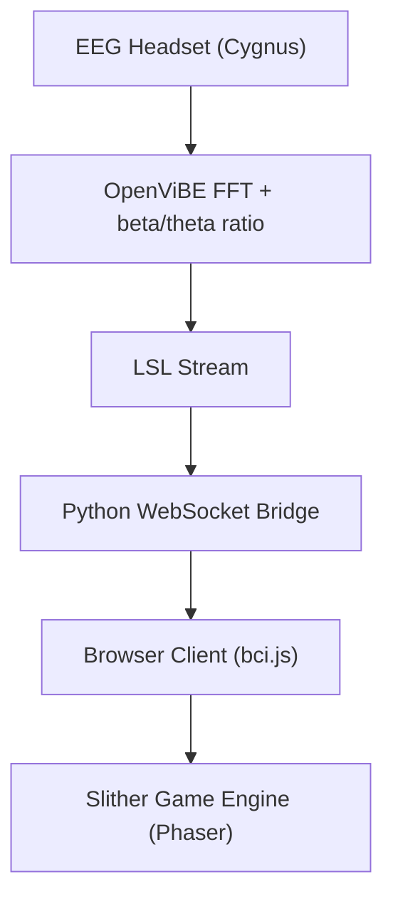

# BCI-Slither.io 🧠🐍  
A Brain-Computer Interface (BCI) integrated browser game inspired by *Slither.io*.  
Real-time EEG signals control snake speed using beta/theta ratio as a cognitive attention indicator.

## 🎯 Project Overview

This project explores brain-computer interaction by integrating EEG-based attention signals into a web-based game environment. It demonstrates how frontal lobe EEG (FP1/FP2) activity can be transformed into interactive game mechanics.

- 🧠 EEG device: 6-channel dry-electrode headset
- 🎮 Game framework: Phaser.js (custom Slither.io clone)
- 🔗 Signal integration: LSL + WebSocket bridge
- 📊 Real-time attention control via beta/theta ratio
- 🎨 Visual feedback: bar indicator with focus marker

---

## 🛠️ System Architecture



---

## 🚀 Getting Started

1. **Clone the repository**
   ```bash
   git clone https://github.com/CECNL/BCI-Slither.io.git
   cd BCI-Slither.io
   ```

2. **Install dependencies (for the web server)**
   ```bash
   npm install
   ```

3. **Run the application**
   ```bash
   node server.js
   ```
   Visit `http://localhost:8080` in your browser.

---

## 🧪 BCI Pipeline

#### A. EEG Signal Simulation (for testing without a device)
```bash
python simulate_bci.py
```

#### B. WebSocket Bridge (to connect with OpenViBE)
```bash
python python-bridge/bci_ws_bridge.py
```
*Requires: `pylsl`, `websockets`*

---

## 🧩 Game Logic
- Snake speed = `baseSpeed × (1 + beta/theta × 2)`
- Focus bar updates every 100ms using the received EEG ratio.
- A marker shifts based on the real-time cognitive state.

---

## 📂 File Structure

```
.
├── asset/                  # Game images (snake, background, UI)
├── src/
│   ├── bci.js              # WebSocket EEG client
│   ├── game.js             # Main Phaser game logic
│   ├── food.js             # Food class
│   ├── snake.js            # Player and bot snake logic
│   └── util.js             # Utilities
├── python-bridge/
│   └── bci_ws_bridge.py    # LSL to WebSocket bridge
├── simulate_bci.py         # EEG signal simulator
└── index.html
```

---

## 👩‍🔬 Demo & Results
- Real-time snake control with EEG attention ratio.
- Visual feedback improves user self-awareness.
- Supports both real EEG signals and simulation.
- Multiplayer game logic (with bots) is integrated.
- The UI includes a dynamic bar with an attention marker.

---

## 📌 Future Work
- Add alpha wave control for sleep/rest mechanics.
- Experiment with motor imagery (left/right).
- Integrate more EEG channels and spatial filtering.
- Polish game design with more feedback elements.

---

## 🧑‍💻 Author

- **Institution:** Cognitive Engineering and Computational Neuroscience Lab (CECNL), National Yang Ming Chiao Tung University
- **Developer:** Mark Tsai

---

## 📄 License

This project is open-source under the MIT License.